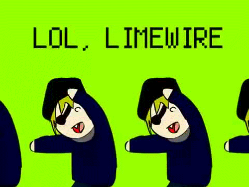

# Apuntes sobre Markdown

## :warning: Aviso

Este texto no pretende ser una guía de Markdown. Simplemente es un material de repaso escrito **por y para mí**. Sin embargo, si le encuentras algún valor, tienes la libertad de replicarlo y hacerle los cambios que consideres necesarios.

## :page_facing_up: Temario {#temario}

1. [Encabezados](#encabezados)
2. [Líneas Horizontales](#lineas-horizontales)
3. [Párrafos](#parrafos)
4. [Estilos de texto](#estilos)
5. [Código](#codigo)
6. [Citas](#citas)
7. [Imagenes](#imagenes)
8. [Enlaces](#enlaces)
9. [Listas](#listas)
10. [Tablas](#tablas)
11. [Editores Online](#editores-online)

## 1. Encabezados {#encabezados}

---

Los encabezados permiten definir el título principal y los subtítulos de un documento.

### 1.1 Sintaxis

Para indicar un encabezado utilizamos como prefijo el símbolo `#`. Además, se recomienda dejar una línea en blanco antes y después de cada encabezado.

```markdown

# Encabezado

```

### 1.2 Niveles

En Markdown contamos con seis niveles de encabezado: El primer nivel lo utilizamos exclusivamente para el título principal y en los demás niveles colocamos los subtítulos o subtemas.

El nivel de un encabezado se determina por la cantidad de símbolos `#` que utilicemos como prefijo.

```markdown
# Encabezado de primer nivel
## Encabezado de segundo nivel
### Encabezado de tercer nivel
#### Encabezado de cuarto nivel
##### Encabezado de quinto nivel
###### Encabezado de sexto nivel
```

[:arrow_up: Volver al temario][temario]

## 2. Líneas Horizontales {#lineas-horizontales}

---

Las líneas horizontales permiten separar de manera visual las secciones de un documento.

### 2.1 Sintaxis

Para dibujar una línea horizontal escribimos tres veces alguno de los siguientes símbolos: ```*```, ```-``` ó ```_```.

**Ejemplo**:

```markdown
---
```

**Salida**:

---

[:arrow_up: Volver al temario][temario]

## 3. Párrafos {#parrafos}

---

### 3.1 Sintaxis

- Cualquier texto genera un párrafo.
- Para escribir en un nuevo párrafo dejamos **una línea en blanco**.
- Para escribir en una nueva línea pero dentro del mísmo párrafo, escribimos **dos espacios** y luego el **salto de línea**.

**Ejemplo**:

```markdown
Este texto genera un párrafo. Para escribir en un nuevo párrafo dejamos una línea en blanco.

Este texto está en un segundo párrafo. Para escribir en una nueva línea, escribimos dos espacios y luego el salto de línea.
Este texto está en una nueva línea pero dentro del mismo párrafo.
```

**Salida**:

Este texto genera un párrafo. Para escribir en un nuevo párrafo dejamos una línea en blanco.

Este texto está en un segundo párrafo. Para escribir en una nueva línea, escribimos dos espacios y luego el salto de línea.
Este texto está en una nueva línea pero dentro del mismo párrafo.

[:arrow_up: Volver al temario][temario]

## 4. Estilos de texto {#estilos}

---

### 4.1 Sintaxis

Para dar estilos a un texto debemos rodearlo utilizando alguno de los siguientes simbolos: `*` ó `_`. El estilo del texto se determina por la cantidad de símbolos utilizados: Uno para *cursiva*, dos para **negrita** y tres para ***cursiva y negrita***.

**Ejemplo**:

```markdown
*Este es un texto en cursiva*
_Este es un texto en cursiva_

**Este es un texto en negrita**
__Este es un texto en negrita__

_**Este es un texto en cursiva y negrita**_
***Este es un texto en cursiva y negrita***
___Este es un texto en cursiva y negrita___

~~Este es un texto tachado~~
```

**Salida**:

*Este es un texto en cursiva*
_Este es un texto en cursiva_

**Este es un texto en negrita**  
__Este es un texto en negrita__

_**Este es un texto en cursiva y negrita**_
***Este es un texto en cursiva y negrita***  
___Este es un texto en cursiva y negrita___

~~Este es un texto tachado~~

[:arrow_up: Volver al temario][temario]

## 5. Código {#codigo}

---

### 5.1 Código en línea

**Ejemplo**:

```markdown
Podemos escribir código JavaScript dentro de la etiqueta `<script></script>` ó llamar a un archivo fuente con extensión `.js` usando el atributo `src`.
```

**Salida**:

Podemos escribir código JavaScript dentro de la etiqueta `<script></script>` ó llamar a un archivo fuente con extensión `.js` usando el atributo `src`.

### 5.2 Código en bloque

**Ejemplo**:

````markdown
```js
let saludar = () => {
    console.log("Hola mundo");
}
```
````

**Salida**:

```js
let saludar = () => {
    console.log("Hola mundo");
}
```

[:arrow_up: Volver al temario][temario]

## 6. Citas {#citas}

---

### 6.1 Sintaxis

Para indicar una cita utilizamos como prefijo el símbolo `>`.

```markdown
> Texto de la cita.
```

**Ejemplo**:

```markdown
> Si no lo puedes explicar de forma sencilla, es que no lo has entendido bien. (A. Einstein)
```

**Salida**:

> Si no lo puedes explicar de forma sencilla, es que no lo has entendido bien. (A. Einstein)

[:arrow_up: Volver al temario][temario]

## 7. Imagenes {#imagenes}

---

### 7.1 Sintaxis

```markdown

```

- El `Texto alternativo` describe la imagen. Lo usan: los buscadores para hacer el posicionamiento, los navegadores web de audio y los navegadores web tradicionales cuando cuando no pueden mostrar la imagen.
- La `URL` puede ser la ruta de una imagen local o externa.

**Ejemplo**:

```markdown


```

**Salida**:


### 7.2 Referencias de imagenes

Una **referencia** es como una variable donde podemos almacenar una URL de una imagen. De modo que si necesitamos poner la misma imagen en varios lugares del documento, podemos reutilizar referencia en lugar de escribir la URL de la imagen en cada lugar.

**Sintaxis**:

```markdown
![Texto alternativo][referencia-img]
[referencia-img]: URL
```

**Ejemplo**:

```markdown
![Texto alternativo][terminal]
[terminal]: assets/terminal.png
```

Se recomienda colocar todas las **referencias** de imágenes al final del documento.

[:arrow_up: Volver al temario][temario]

## 8. Enlaces {#enlaces}

---

Los enlaces permiten redirigir a una parte específica del mismo documento, a otro documento u otro recurso.

## 8.1 Enlace normal

**Sintaxis**:

```markdown
<URL>
```

**Ejemplo**:

```markdown
<https://github.com>
```

**Salida**:

<https://github.com>

### 8.2 Hiperenlace / Hipertexto / Hipervínculo

**Sintaxis**:

```markdown
[Texto](URL)
[Texto](URL "Texto informativo")
```

- `URL` puede apuntar a un recurso **local** o **externo**.
- Si agregamos una cadena de texto después de la `URL`, se mostrará un _tooltip_ con el texto informativo cada vez que el cursor esté sobre el enlace.

**Ejemplo**:

```markdown
[Ir al archivo ABOUT.md](ABOUT.md "Este es un recurso local")
[Ir a Google](https://www.google.com "Este es un recurso externo")
```

**Salida**:

[Ir al archivo ABOUT.md](ABOUT.md "Este es un recurso local")
[Ir a Google](https://www.google.com "Este es un recurso externo")

### 8.3 Referencias de enlaces

**Sintaxis**:

Una **referencia** es como una variable donde podemos almacenar una URL. De modo que si nuestro documento tiene varios hipervínculos apuntando a la misma URL, podemos reutilizar la referencia en lugar de escribir la URL en cada hipervínculo.

```markdown
[Texto][referencia]
[referencia]: URL
```

**Ejemplo**:

```markdown
[Volver al temario][temario]
[temario]: #temario
```

Se recomienda colocar todas las **referencias** de enlaces al final del documento.

### 8.4 Imagenes como enlaces

**Sintaxis**:

```makdown
[](URL-del-enlace)
```

**Ejemplo**:

```markdown
[](https://youtu.be/IBH4g_ua5es)
```

**Salida**:

[](https://youtu.be/IBH4g_ua5es)

### 8.5 Marcadores

**Sintaxis**:

Un marcador consta de un hipervínculo apuntando hacia un encabezado marcado con un identificador. El encabezado podría estar en el mismo documento o en otro documento.

```markdown
## Encabezado {#identificador}

[Texto](#identificador)
```

**Ejemplo**:

```markdown
## Temario {#temario}
[Volver al temario](#temario)
```

[:arrow_up: Volver al temario][temario]

## 9. Listas {#listas}

---

Una lista es un conjunto de elementos.

### 9.1 Listas desordenadas

Para generar una lista desordenada debemos **enumerar** sus elementos utilizando como prefijo cualquiera de estos tres símbolos: ```*```, ```-``` ó ```+```.

**Ejemplo**:

```markdown
- Item
- Item
- Item
```

**Salida**:

- Item
- Item
- Item

### 9.2 Listas ordenadas

Para generar una lista ordenada debemos **numerar** sus elementos utilizando como prefijo el `número de orden` y el simbolo ```.```

**Ejemplo**:

```markdown
1. Item 1
2. Item 2
3. Item n-1
4. Item n
```

**Salida**:

1. Item 1
2. Item 2
3. Item n-1
4. Item n

### 9.3 Listas anidadas

Las listas anidadas son listas que están dentro de otras listas. Para generarlas debemos añadir cuatro espacios en blanco antes del prefijo de cada item.

**Ejemplo**:

```markdown
1. Item 1
    - Sub Item
    - Sub Item
        - Sub Sub Item
        - Sub Sub Item
    - Sub Item
        1. Sub Sub Item
        2. Sub Sub Item
    - Sub Item
2. Item 2
    1. Sub Sub Item
    2. Sub Sub Item
3. Item n-1
4. Item n
```

**Salida**:

1. Item 1
    - Sub Item
    - Sub Item
        - Sub Sub Item
        - Sub Sub Item
    - Sub Item
        1. Sub Sub Item
        2. Sub Sub Item
    - Sub Item
2. Item 2
    1. Sub Sub Item
    2. Sub Sub Item
3. Item n-1
4. Item n

### 9.4 Listas de definición

En este tipo de lista los elementos son parejas de la forma **término : definición**.

Podemos encontrar este tipo de listas en glosarios, enciclopedias, diccionarios, etc.

**Ejemplo**:

```markdown
Término 1
: Definición 1

Término 2
: Definición 1
: Definición 2
```

**Salida**:

Término 1
: Definición 1

Término 2
: Definición 1
: Definición 2

[:arrow_up: Volver al temario][temario]

## 10. Tablas {#tablas}

---

Las tablas permiten mostrar datos de manera tabular (en filas y columnas).

### 10.1 Sintaxis

**Ejemplo**:

```markdown
| Cabecera   | Cabecera   |
|------------|------------|
| Dato       | Dato       |
| Dato       | Dato       |
| Dato       | Dato       |
```

**Salida**:

| Cabecera   | Cabecera   |
|------------|------------|
| Dato       | Dato       |
| Dato       | Dato       |

### 10.2 Alineación de columnas

Para indicar la alineación de una columna utilizamos el símbolo `:`.

**Ejemplo**:

```markdown
| A          | B          | C          |
|:-----------|:----------:|-----------:|
| Dato       | Dato       | Dato       |
| Izquierda  | Centro     |Derecha     |
| Dato       | Dato       | Dato       |
```

**Salida**:

| A          | B          | C          |
|:-----------|:----------:|-----------:|
| Dato       | Dato       | Dato       |
| Izquierda  | Centro     |Derecha     |
| Dato       | Dato       | Dato       |

[:arrow_up: Volver al temario][temario]

## 11. Editores Online {#editores-online}

---

- [StackEdit](https://stackedit.io/app)
- [Dillinger](https://dillinger.io/)

[:arrow_up: Volver al temario][temario]

[temario]: #temario
